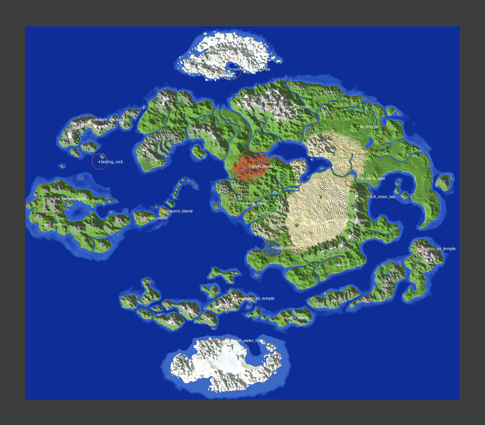

# ATLA 1:1 Map: Landmark Population

`atla_builder` adds *Avatar: The Last Airbender* structures to the 9k × 7k custom terrain world `ATLAB9k.zip`. It places 25 story landmarks, 123 settlements themed by nation and a road network. It also writes a JSON log of every placement for the quest-scripting module.



## Quick start

```bash
pip install -r requirements.txt
python -m atla_builder build --world ATLAB9k.zip --out out --zip
```

`ATLAB9k.zip` is stored with Git LFS. GitHub's **Download ZIP** button (and `git clone` without
Git LFS installed) gives you a 134-byte pointer file instead of the 772 MB world. The build
detects the pointer and downloads the real file into `out/_work/`, checking its SHA-256. For a
private repository, set a token with read access first (`$env:GITHUB_TOKEN="..."` in
PowerShell). You can also pass the real file or an unzipped world folder with `--world`.

The build takes about 4 minutes on 4 cores (a 2-minute terrain scan, then about 100 s of building and writing). The `out/` folder then contains:

| Path | What it is |
| --- | --- |
| `out/ATLAB9k_populated/` (+ `.zip`) | A copy of the world with everything placed. The input world is never modified. |
| `out/placements.json` | The log for the quest-scripting module: landmark centres, bounding boxes, points of interest (POIs), settlements and roads. |
| `out/schematics/*.schem` | Sponge v3 schematics (WorldEdit/FAWE) of each landmark's structure layer. |
| `out/overview.png` | The map with every located site marked. |

A copy of the log, the schematics and the overview from the run against `ATLAB9k.zip` is committed in [`output/`](output/).

Other commands:

```bash
python -m atla_builder locate  --world ATLAB9k.zip --out scan/        # scan + georeference + sites.json only
python -m atla_builder build   --world ATLAB9k.zip --out out --only omashu ba_sing_se --no-scatter
python -m atla_builder preview --terrain scan/terrain.npz --georef scan/georef.json --landmark omashu --png omashu.png
python -m pytest -q                                                  # 39 tests
```

## How it works

1. **Scan.** Every chunk is decoded and each column records ground height, water surface, canopy top and surface material. The results are cached in `terrain.npz`.
2. **Georeference.** `reference/terrain_classes.png` is a terrain-class raster derived from the painted source map. The pipeline registers it against the world's land mask. For `ATLAB9k` the fit is exact at 16 blocks per reference pixel, with an intersection-over-union (IoU) of 0.974.
3. **Locate.** Each landmark in [`config/landmarks.json`](config/landmarks.json) has an anchor on the reference map, checked against the canon *Aang's Journey* map. A terrain strategy then refines it:
   - `peak`: air temples, Omashu, the Fire Nation Capital.
   - `coast` and `coast_flat`: the Water Tribes, Full Moon Bay.
   - `island`: Kyoshi, Ember and Crescent islands.
   - `inland_max`: Ba Sing Se.
   - `desert`: the library and the rock.
   - `ravine`: the Western Air Temple.
   - `sea`: the Boiling Rock.
   - `path`: the Serpent's Pass.
4. **Scale check.** Each builder sizes itself to the usable radius the locator measured, then blends into the terrain. The integration step used for each landmark is recorded in the log.
5. **Build and write.** Builders draw into sparse edit buffers, one for terrain and one for structure. Edited sections are re-encoded in the chunk's own format and DataVersion.
   - Heightmaps are dropped and `isLightOn` is cleared, so Minecraft recomputes both on load.
   - WorldPainter proto-chunks (`liquid_carvers`) that get edited are promoted to `full`. Otherwise vanilla feature generation would grow trees and lakes over the new buildings.
6. **Scatter.** Settlements are placed by Poisson spacing, avoiding landmarks and each nation's unsuitable terrain. A minimum-spanning road network links them and the landmarks so NPCs have paths to follow.

## Landmarks (from the committed run)

| Tier | Landmark | Centre (x, y, z) | Terrain integration |
| --- | --- | --- | --- |
| 1 | Southern Water Tribe *(quest start)* | -394, 65, 2738 | Snow shelf levelled on the flat north coast, beach cut for the dock, Aang's iceberg offshore |
| 1 | Northern Water Tribe & Spirit Oasis | -250, 96, -3096 | Ice shelf terraced into 4 tiers around the bay, ring and radial canals, great harbour wall with water gate |
| 1 | Foggy Swamp (banyan-grove tree) | 632, 63, 739 | Grown in the painted swamp wetland; 18 surface roots spread across it |
| 2 | Southern Air Temple | -138, 249, 1810 | Summit cut to a plaza, towers step down the flanks, pilgrim stair |
| 2 | Northern Air Temple (Mechanist) | 582, 259, -2234 | Spire trimmed under the build limit; copper pipes, gears, workshop, war balloon, gas cavern |
| 2 | Eastern Air Temple | 3750, 245, 762 | Five rock spires with towers, rope bridges, Guru Pathik's ledge |
| 2 | Western Air Temple | -3344, 89, -1883 | Gorge carved along the ridge; towers hang **inverted** under both rims; fountain courtyard |
| 3 | Kyoshi Island | 762, 68, 2342 | Coastal flat; Avatar Kyoshi statue, Kyoshi Warriors' dojo, pier |
| 3 | Omashu | 658, 152, 254 | Peak reshaped into a 4-tier mesa inside a chasm; bridge and gate, palace, 3 spiralling **mail chutes** |
| 3 | Senlin Village & Spirit Forest | 190, 85, 14 | Village plus a burnt forest with Hei Bai's statue and the acorn |
| 3 | The Great Divide | 158, 67, -978 | 640-block terraced canyon with terracotta strata, ranger station, switchback trail |
| 3 | Gaoling | 1954, 86, 1098 | Town, walled Beifong estate, **underground Earth Rumble VI arena** with cave entrance |
| 3 | Serpent's Pass | 2478, 67, -671 | Meandering rock spine with flooded moats and sunken gaps, "Abandon hope" sign |
| 3 | Ba Sing Se | 2438, 84, -1818 | See below |
| 3 | Full Moon Bay | 2624, 66, -334 | Sheltered cove, ferry terminal, passport office, 3 piers, 2 ferries |
| 3 | Wan Shi Tong's Library | 1786, 79, 158 | Buried hall; only the spire shows above the dunes; planetarium |
| 3 | Misty Palms Oasis | 1146, 67, 222 | Pool, palms, adobe buildings, sand-sailer |
| 3 | Si Wong rock | 1622, 72, -254 | Rock formation with a shelter overhang |
| 3 | Wulong Forest | -54, 81, -202 | About 60 karst pillars (some broken); final-battle pillar POI |
| 4 | Crescent Island Fire Temple | -1670, 145, -34 | Temple with its tall spire, Roku's sanctuary behind the five-dragon door, lava vent |
| 4 | Sun Warriors' ancient city | -4222, 78, 250 | Stepped pyramid with the Sun Stone, Dancing Dragon plaza, ruins, Eternal Flame, Masters' cave |
| 4 | The Boiling Rock | -3018, 75, -1070 | Crater island raised from the seabed; magma lake floor with bubble columns (it really boils); prison, cooler, gondola |
| 4 | Ember Island | -2258, 75, 38 | Shaped sand beach, Ember Island Players theatre, royal beach house, resort town |
| 4 | Fire Nation Capital | -4010, 163, -294 | Volcano hollowed into the Royal Caldera; palace, Royal Plaza, Agni Kai arena, terraced city, Harbor City and rim road |

**Ba Sing Se** is the largest structure on the map (1,120 × 1,000 blocks):
- **Outer Wall:** a 60-block wall with walkway, crenellations, towers, four gatehouses and culverts where rivers pass through.
- **Agrarian Zone:** 34×24 crop plots, irrigation ditches and about 70 farmhouses.
- **Monorail:** elevated viaducts with stations running from each outer gate.
- **Inner Wall and districts:** the dense Lower Ring, the Middle Ring (including the University) and the Upper Ring (including the Jasmine Dragon), each on a higher terrace.
- **Palace:** the Earth King's Palace on the top plateau.
- **Lake Laogai:** uses the natural lake in the Agrarian Zone. The Dai Li base is underneath, with a headquarters hall, prison cells and the brainwashing chamber, reached from a hidden shoreline shaft.

Previews in [`docs/previews/`](docs/previews/): isometric renders of each builder, plus top-down renders of Ba Sing Se read back from the written world.

## `placements.json` schema

```jsonc
{
  "world": {"data_version": 3837, "sea_level": 62, "georef": {...}},
  "quest_start": {"x": -394, "y": 65, "z": 2738},
  "landmarks": [{
    "id": "omashu", "name": "...", "nation": "earth", "story_tier": 3, "episodes": ["1x05 ..."],
    "center": {"x": 658, "y": 152, "z": 254},          // walkable surface at the centre
    "bbox": {"min": {...}, "max": {...}},
    "site": {...},                                      // locator result (strategy, facing, fit radius)
    "schematic": {"type": "procedural", "generator": "atla_builder.structures.earth.omashu", "seed": 0,
                  "files": [{"file": "omashu.schem", "size": [w, h, l], "world_origin": [x, y, z]}]},
    "terrain_integration": ["peak reshaped into a 4-tier mesa ..."],
    "points_of_interest": {"king_bumi_palace": {"x":..,"y":..,"z":.., "desc": "..."}, "mail_chute_1_top": {...}}
  }],
  "settlements": [{"id": "earth_farm_hamlet_004", "kind": "farm_hamlet", "nation": "earth", "center": {...}}],
  "roads": [{"from": "earth_farm_hamlet_004", "to": "omashu", "length": 412}]
}
```

The log contains 110 landmark POIs, including spawn points for creatures and characters the mod adds: Tui & La's koi, the serpent's lair, the Unagi waters and Hei Bai.

## Sourcing and fidelity

- **No community schematics were used.** Download sites such as Planet Minecraft are not reachable from the build environment. Most community builds are also not licensed for redistribution, and their fidelity can't be reviewed from here. Every structure is therefore generated procedurally to canon references: layout, silhouette and the palette described in [`atla_builder/palettes.py`](atla_builder/palettes.py).
- **Adding a community build.** Once one passes your fidelity review, add it to [`config/schematic_overrides.json`](config/schematic_overrides.json) with `"approved": true`. It is pasted at the located site instead of the procedural build, and its block ids are remapped for the world's version.
- **Pasting the exported schematics.** They hold only the structure layer; the terrain integration exists only in the world. Paste them with `//schem load <id>` and then `//paste -m !minecraft:structure_void`.

## Version notes

- `ATLAB9k` is a 1.20.5 level (DataVersion 3837) whose chunks were written by WorldPainter as 1.18 proto-chunks (DataVersion 2860).
- Edited chunks keep their DataVersion, so Minecraft's DataFixer still upgrades the untouched WorldPainter content when a newer game opens the world. New blocks are written with names that are valid in the level's version, for example `short_grass`.
- Every block used exists in 1.20+.
- After editing, all 358,400 chunks were re-parsed with zero failures.

## Limitations

- No entities are placed: no NPCs, animals, boats as entities, or the serpent. Those belong to the mod; their spawn points are POIs in the log.
- Signs are the only block entities written. Chests and other containers are not placed.
- Settlements between landmarks use generic nation-themed houses rather than named canon villages.

## Layout

```
atla_builder/        anvil.py (region/chunk IO), buffer.py (edit buffers & primitives), terrain.py (scan),
                     geo.py + locate.py (georef & site search), structures/ (water, air, earth, basingse,
                     fire, kit, village), scatter.py, schem.py, pipeline.py, render.py, preview.py, cli.py
config/              landmarks.json, schematic_overrides.json
reference/           terrain_classes.png (derived from the painted map; used for registration)
tools/               make_reference_classes.py, preview_landmark.py
tests/               anvil/buffer/rotation/schem/georef tests + a smoke test for every builder
output/              placements.json, overview.png, georef.json, schematics/ from the ATLAB9k run
```
